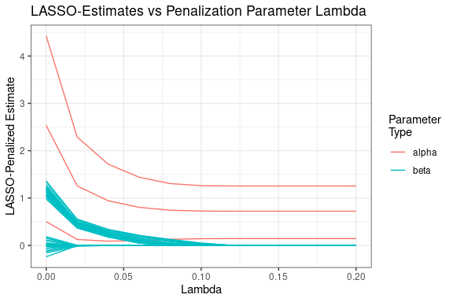

HOOVS: High Dimensional Ordinal Outcome Variable Selection
================
Ben Bodek, Brian Chen, Forrest Hurley, Brian Richardson, Emmanuel
Rockwell

## Description

The `HOOVS` package (“High-Dimensional Ordinal Outcome Variable
Selection”) is for a group project for Bios 735 (statistical computing).
The goal of the project is to develop two methods to perform variable
selection on a high-dimensional data set with an ordinal outcome. The
first method is a LASSO-penalized ordinal regression model and the
second is a random forest model.

## Installation

Installation of the `bios-735-project` from GitHub requires the
[`devtools`](https://www.r-project.org/nosvn/pandoc/devtools.html)
package and can be done in the following way.

``` r
# Install the package
devtools::install_github("brian-d-richardson/HOOVS")
```

``` r
# Then load it
library(HOOVS)
```

Other packages used in this README can be loaded in the following
chunck.

``` r

suppressPackageStartupMessages(if (!require(dplyr)) {install.packages("dplyr")})
suppressPackageStartupMessages(if (!require(tidyr)) {install.packages("tidyr")})
suppressPackageStartupMessages(if (!require(ggplot2)) {install.packages("ggplot2")})
suppressPackageStartupMessages(if (!require(ordinalNet)) {install.packages("ordinalNet")})
suppressPackageStartupMessages(if (!require(foreign)) {install.packages("foreign")})
suppressPackageStartupMessages(if (!require(devtools)) {install.packages("devtools")})
suppressPackageStartupMessages(if (!require(tictoc)) {install.packages("tictoc")})
load_all()
#> ℹ Loading HOOVS

#For reproducibility
set.seed(1)
```

# Method 1: LASSO-Penalized Ordinal Regression Model

We begin with a theoretical introduction of the ordinal regression model
and how the `HOOVS` package calculates parameter estimates.

## Ordinal Regression Model Setup

Suppose that, for observation $i = 1, \dots, n$, the ordinal outcome
$Y_i$ given the covariate vector $\pmb{x}_i$ has a multinomial
distribution with $J$ outcome categories and probabilities of success
$\pi_1(\pmb{x}_i), \dots, \pi_J(\pmb{x}_i)$. That is,

$$Y_i | \pmb{x}_i \sim \text{multinomial} \{ 1; \pi_1(\pmb{x}_i), \dots, \pi_J(\pmb{x}_i) \}.$$

The cumulative probability for subject $i$ and ordinal outcome category
$j$ is $P(Y_i \leq j | \pmb{x}_i) = \sum_{k=1}^j \pi_k(\pmb{x}_i)$. Note
that by definition $P(Y_i \leq J | \pmb{x}_i) = 1$.

The following proportional odds model relates the cumulative probability
for subject $i$ and ordinal outcome category $j$ to the covariates
$\pmb{x}_i$ via the parameters
$\pmb{\alpha} = (\alpha_1, \dots, \alpha_{J-1})^T$ and
$\pmb{\beta} = (\beta_1, \dots, \beta_p)^T$ with a logit link function.

$$ \text{logit}\{ P(Y_i \leq j | \pmb{x}_i) \} = \alpha_j + \pmb{x}_i^T \pmb{\beta}. $$

In this model, $\alpha_1, \dots, \alpha_{J-1}$ are outcome
category-specific intercepts for the first $J-1$ ordinal outcome
categories and $\beta_1, \dots, \beta_p$ are the slopes corresponding to
the $p$ covariates. Since the cumulative probabilities must be
nondecreasing in $j$, i.e., is
$P(Y_i \leq j | \pmb{x}_i) < P(Y_i \leq j+1 | \pmb{x}_i)$, we require
that $\alpha_1 < \dots < \alpha_{J-1}$.

The likelihood function for the ordinal regression model is

$$ L_n(\pmb{\alpha}, \pmb{\beta}) = \prod_{i=1}^n \prod_{j=1}^J \left\{ \text{logit}^{-1}(\alpha_j + \pmb{x}_i^T\pmb{\beta}) - \text{logit}^{-1}(\alpha_{j-1} + \pmb{x}_i^T\pmb{\beta} )   \right\} ^ {_(y_i = j)}. $$

## LASSO Penalization

Let
$l(\pmb{\alpha}, \pmb{\beta}) = \frac{-1}{n} \log L(\pmb{\alpha}, \pmb{\beta})$
be the standardized log-likelihood.

The LASSO-penalized ordinal regression model is fit by minimizing the
following objective function with respect to $\pmb{\alpha}$ and
$\pmb{\beta}$.

$$ f(\pmb{\alpha}, \pmb{\beta}) = l(\pmb{\alpha}, \pmb{\beta}) + \lambda\sum_{j=1}^p|\beta_j|. $$

## Proximal Gradient Descent Algorithm

The objective function can be minimized using a proximal gradient
descent (PGD) algorithm.

Fix the following initial parameters for the PGD algorithm: $m > 0$ (the
initial step size), $a \in (0, 1)$ (the step size decrement value), and
$\epsilon > 0$ (the convergence criterion).

The proximal projection operator for the LASSO penalty (applied to
$\pmb{\beta}$ but not to $\pmb{\alpha}$) is

$$ \text{prox}_{\lambda m}(\pmb{w}, \pmb{z}) = \text{argmin}_{\pmb{\alpha}, \pmb{\beta}} \frac{1}{2m} \left(||\pmb{w} - \pmb{\alpha} ||_2^2 + ||\pmb{z} - \pmb{\beta} ||_2^2 \right) + \lambda\sum_{j=1}^p|\beta_j| = \left\{ \pmb{w},  \text{sign}(\pmb{z})(\pmb{z} - m \lambda)_+ \right\} $$

Given current estimates
$\pmb{\theta}^{(k)} = (\pmb{\alpha}^{(k)}, \pmb{\beta}^{(k)})^T$, search
for updated estimates $\pmb{\theta}^{(k+1)}$ by following the steps:

1)  propose a candidate update
    $\pmb{\theta} = \text{prox}_{\lambda m}\left\{\pmb{\theta}^{(k)} - \frac{1}{m} \nabla l(\pmb{\theta}^{(k)})\right\}$,

2)  if the condition
    $l(\pmb{\theta}) \leq l(\pmb{\theta}^{(k)}) + \nabla l(\pmb{\theta}^{(k)})^T(\pmb{\theta} - \pmb{\theta}^{(k)}) + \frac{1}{2m} (\pmb{\theta} - \pmb{\theta}^{(k)})^T (\pmb{\theta} - \pmb{\theta}^{(k)})$
    is met, then make the the update
    $\pmb{\theta}^{(k+1)} = \pmb{\theta}$,

3)  else decrement the step size $m = am$ and returning to step 2.

Continue updating $\pmb{\theta}^{(k)}$ until convergence, i.e., until
$\left|\frac{f(\pmb{\theta}^{(k+1)}) - f(\pmb{\theta}^{(k)})}{f(\pmb{\theta}^{(k)})}\right| < \epsilon$.

A technical note is that the $\pmb{\alpha}$ parameters are constrained
by $\alpha_1 < \dots < \alpha_{J-1}$. We can reparametrize the model
with $\pmb{\zeta} = (\zeta_1, \dots, \zeta_{J-1})^T$, where
$\zeta_1 = \alpha_1$ and $\zeta_j = \log(\alpha_j - \alpha_{j-1})$ for
$j = 2, \dots, J-1$. Then $\pmb{\zeta} \in \mathbb{R}^{J-1}$ have no
constraints. So we can follow the above procedure to minimize the above
objective function with respect to $\pmb{\zeta}$ and $\pmb{\beta}$, then
back-transform to obtain estimates for $\pmb{\alpha}$.

## Data Generation

The `HOOVS` package allows the user to simulate their own data with the
`simulate.data()` function. For $n$ subjects, we generate $p$ covariates
from independent standard normal distributions[^1]. Given true
parameters $\pmb{\alpha}_0$ and $\pmb{\beta}_0$, we compute the
multinomial probabilities for the outcome for each individual and
simulate $y_i$ accordingly.

``` r

# sample size
n <- 1000

# number of covariates
p <- 50

# number of categories for ordinal outcome
J <- 4

# grid of lambdas
lambdas <- seq(0, 0.2, 0.02)

# set population parameters
alpha <- seq(.5, 4, length = J - 1) # category-specific intercepts
beta <- rep(0, p)                     # slope parameters
beta[1: floor(p / 2)] <- 1            # half of the betas are 0, other half are 1

# simulate data according to the above parameters
dat <- simulate.data(
  n = 1000,
  alpha = alpha,
  beta = beta)
```

For this example, we simulated data with $n$ = 1000 observations, $p$ =
50 covariates, $J$ = 4 ordinal outcome categories, and true parameter
values of $\pmb{\alpha}_0$ = (0.5, 2.25, 4) and $\pmb{\beta}_0$ = (1, 1,
1, 1, 1, 1, 1, 1, 1, 1, 1, 1, 1, 1, 1, 1, 1, 1, 1, 1, 1, 1, 1, 1, 1, 0,
0, 0, 0, 0, 0, 0, 0, 0, 0, 0, 0, 0, 0, 0, 0, 0, 0, 0, 0, 0, 0, 0, 0, 0).
Note that this implies the first half of the covariates are truly
associated with the outcome and the last half are not. The first 10 rows
and 10 columns of the data set are shown below.

``` r

dat[1:10, 1:10] %>% 
  mutate_if(.predicate = function(x) is.numeric(x),
            .funs = function(x) round(x, digits = 2))
#>    y    X1    X2    X3    X4    X5    X6    X7    X8    X9
#> 1  3 -0.63  1.13 -0.89  0.74 -1.13 -1.52 -0.62 -1.33  0.26
#> 2  3  0.18  1.11 -1.92  0.39  0.76  0.63 -1.11  0.95 -0.83
#> 3  3 -0.84 -0.87  1.62  1.30  0.57 -1.68 -2.17  0.86 -1.46
#> 4  2  1.60  0.21  0.52 -0.80 -1.35  1.18 -0.03  1.06  1.68
#> 5  4  0.33  0.07 -0.06 -1.60 -2.03  1.12 -0.26 -0.35 -1.54
#> 6  1 -0.82 -1.66  0.70  0.93  0.59 -1.24  0.53 -0.13 -0.19
#> 7  3  0.49  0.81  0.05  1.81 -1.41 -1.23 -0.56  0.76  1.02
#> 8  1  0.74 -1.91 -1.31 -0.06  1.61  0.60  1.61 -0.49  0.55
#> 9  1  0.58 -1.25 -2.12  1.89  1.84  0.30  0.56  1.11  0.76
#> 10 1 -0.31  1.00 -0.21  1.58  1.37 -0.11  0.19  1.46 -0.42
```

## Fitting Penalized Model

Now run our version of a LASSO-penalized ordinal regression function on
the simulated data for various values of $\lambda$: 0, 0.02, 0.04, 0.06,
0.08, 0.1, 0.12, 0.14, 0.16, 0.18, 0.2.

``` r

# test HOOVS LASSO-penalized ordinal regression function
tic("HOOVS ordreg.lasso() function")
res.ordreg <- ordreg.lasso(
  formula = y ~ .,
  data = dat,
  lambdas 
)
toc()
#> HOOVS ordreg.lasso() function: 5.83 sec elapsed

coef.ordreg <- cbind(res.ordreg$alpha, res.ordreg$beta)
```

We can now look at how the parameter estimates from our funciton change
as the penalty parameter $\lambda$ changes

<!-- -->

Note in the above plot that the $\pmb{\alpha}$ estimates do not shrink
all the way to 0 since they are not penalized in the LASSO model. On the
other hand, the $\pmb{\beta}$ estimates do shrink to 0 as $\lambda$
increases. Recall that the data were simulated according to a model
where half of the $\pmb{\beta}$ values are truly 0 and the other half
are truly 1. It is clear in the above plot which covariates are truly
not associated with the outcome based on how fast their corresponding
parameter estimates shrink to 0.

# Method 2: Random Forest

[^1]: the current version can only handle continuous covariates, and
    categorical variables must be created into dummy variables by hand.
