```{r setup, include=FALSE}
knitr::opts_chunk$set(echo = TRUE)

suppressPackageStartupMessages(if (!require(dplyr)){install.packages("dplyr")})
suppressPackageStartupMessages(if (!require(tidyr)){install.packages("tidyr")})
suppressPackageStartupMessages(if (!require(ggplot2)){install.packages("ggplot2")})
suppressPackageStartupMessages(if (!require(ordinalNet)){install.packages("ordinalNet")})
suppressPackageStartupMessages(if (!require(foreign)){install.packages("foreign")})
suppressPackageStartupMessages(if (!require(devtools)){install.packages("devtools")})
suppressPackageStartupMessages(if (!require(tictoc)){install.packages("tictoc")})
suppressPackageStartupMessages(if (!require(psych)){install.packages("psych")})
suppressPackageStartupMessages(if (!require(caret)){install.packages("caret")})
suppressPackageStartupMessages(if (!require(Boruta)){install.packages("Boruta")})
suppressPackageStartupMessages(if (!require(ordinalForest)){install.packages("ordinalForest")})
suppressPackageStartupMessages(if (!require(cvms)){install.packages("cvms")})
suppressPackageStartupMessages(if (!require(data.table)){install.packages("data.table")})
suppressPackageStartupMessages(if (!require(rlang)){install.packages("rlang")})
load_all()

#For reproducibility
set.seed(1)
```

# Introduction

## Data Description

The dataset we will use for our project is from the Americans' Changing Lives (ACL) longitudinal survey that tracks sociological, psychological, mental, and physical health items. The study has a primary focus focus in differences between Black and White Americans. The first wave of surveys was conducted in 1986 and included 3,617 adults ages 25 and up, with Black Americans and people aged 60 and over over-sampled at twice the rate of the others. The survivors at each measurement were re-interviewed in 1989, 1994, 2002, and 2011, called Waves II, III, IV, and V, respectively. 

## Our Aims for the project

The overarching goal of this project will be evaluating the association of the available demographic, sociographic, and psychographic variables with participants’ self reported life satisfaction. Specifically, we aim to identify factors which are predictive of high or low satisfaction with life. Because life satisfaction is an ordinal variable, with responses ranging from 1. Completely satisfied to 2. Not at all satisfied, our analysis methods must be designed to handle ordinal outcomes to avoid loss of information. Furthermore, the ACL survey is a high dimensional data set. Therefore, in order to conduct the usual inference with a generalized linear model, we must first reduce this dimensionality.

To achieve the goal of identifying factors associated with life satisfaction, we aim to reduce the data set dimensionality with two methods: ordinal LASSO regression and Random Forests. 

# Methods

## Ordinal Regression Model:

Suppose that, for observation $i = 1, \dots, n$, the ordinal outcome $Y_i$ given the covariate vector $\pmb{x}_i$ has a multinomial distribution with $J$ outcome categories and probabilities of success $\pi_1(\pmb{x}_i), \dots, \pi_J(\pmb{x}_i)$. That is,

$$Y_i | \pmb{x}_i \sim \text{multinomial} \{ 1; \pi_1(\pmb{x}_i), \dots, \pi_J(\pmb{x}_i) \}.$$

The cumulative probability for subject $i$ and ordinal outcome category $j$ is $P(Y_i \leq j | \pmb{x}_i) = \sum_{k=1}^j \pi_k(\pmb{x}_i)$. Note that by definition $P(Y_i \leq J | \pmb{x}_i) = 1$.

The following proportional odds model relates the cumulative probability for subject $i$ and ordinal outcome category $j$ to the covariates $\pmb{x}_i$ via the parameters $\pmb{\alpha} = (\alpha_1, \dots, \alpha_{J-1})^T$ and $\pmb{\beta} = (\beta_1, \dots, \beta_p)^T$ with a logit link function.

$$ \text{logit}\{ P(Y_i \leq j | \pmb{x}_i) \} = \alpha_j + \pmb{x}_i^T \pmb{\beta}. $$

In this model, $\alpha_1, \dots, \alpha_{J-1}$ are outcome category-specific intercepts for the first $J-1$ ordinal outcome categories and $\beta_1, \dots, \beta_p$ are the slopes corresponding to the $p$ covariates. Since the cumulative probabilities must be nondecreasing in $j$, i.e., is $P(Y_i \leq j | \pmb{x}_i) < P(Y_i \leq j+1 | \pmb{x}_i)$, we require that $\alpha_1 < \dots < \alpha_{J-1}$.

### Estimation

The likelihood function for the ordinal regression model is

$$ L_n(\pmb{\alpha}, \pmb{\beta}) = \prod_{i=1}^n \prod_{j=1}^J \left\{ \text{logit}^{-1}(\alpha_j + \pmb{x}_i^T\pmb{\beta}) - \text{logit}^{-1}(\alpha_{j-1} + \pmb{x}_i^T\pmb{\beta} )   \right\} ^ {_(y_i = j)}. $$

Let $l(\pmb{\alpha}, \pmb{\beta}) = \frac{-1}{n} \log L(\pmb{\alpha}, \pmb{\beta})$ be the standardized log-likelihood.

The LASSO-penalized ordinal regression model is fit by minimizing the following objective function with respect to $\pmb{\alpha}$ and $\pmb{\beta}$.

$$ f(\pmb{\alpha}, \pmb{\beta}) = -l(\pmb{\alpha}, \pmb{\beta}) + \lambda\sum_{j=1}^p|\beta_j|. $$

### Proximal Gradient Descent Algorithm

The objective function can be minimized using a proximal gradient descent (PGD) algorithm.

Fix the following initial parameters for the PGD algorithm: $m > 0$ (the initial step size), $a \in (0, 1)$ (the step size decrement value), and $\epsilon > 0$ (the convergence criterion).

The proximal projection operator for the LASSO penalty (applied to $\pmb{\beta}$ but not to $\pmb{\alpha}$) is

$$ \text{prox}_{\lambda m}(\pmb{w}, \pmb{z}) = \text{argmin}_{\pmb{\alpha}, \pmb{\beta}} \frac{1}{2m} \left(||\pmb{w} - \pmb{\alpha} ||_2^2 + ||\pmb{z} - \pmb{\beta} ||_2^2 \right) + \lambda\sum_{j=1}^p|\beta_j| = \left\{ \pmb{w},  \text{sign}(\pmb{z})(\pmb{z} - m \lambda)_+ \right\} $$

Given current estimates $\pmb{\theta}^{(k)} = (\pmb{\alpha}^{(k)}, \pmb{\beta}^{(k)})^T$, search for updated estimates $\pmb{\theta}^{(k+1)}$ by following the steps:

1)  propose a candidate update $\pmb{\theta} = \text{prox}_{\lambda m}\left\{\pmb{\theta}^{(k)} - \frac{1}{m} \nabla l(\pmb{\theta}^{(k)})\right\}$,

2)  if the condition $l(\pmb{\theta}) \leq l(\pmb{\theta}^{(k)}) + \nabla l(\pmb{\theta}^{(k)})^T(\pmb{\theta} - \pmb{\theta}^{(k)}) + \frac{1}{2m} (\pmb{\theta} - \pmb{\theta}^{(k)})^T (\pmb{\theta} - \pmb{\theta}^{(k)})$ is met, then make the the update $\pmb{\theta}^{(k+1)} = \pmb{\theta}$,

3)  else decrement the step size $m = am$ and returning to step 2.

Continue updating $\pmb{\theta}^{(k)}$ until convergence, i.e., until $\left|\frac{f(\pmb{\theta}^{(k+1)}) - f(\pmb{\theta}^{(k)})}{f(\pmb{\theta}^{(k)})}\right| < \epsilon$.

A technical note is that the $\pmb{\alpha}$ parameters are constrained by $\alpha_1 < \dots < \alpha_{J-1}$. We can reparametrize the model with $\pmb{\zeta} = (\zeta_1, \dots, \zeta_{J-1})^T$, where $\zeta_1 = \alpha_1$ and $\zeta_j = \log(\alpha_j - \alpha_{j-1})$ for $j = 2, \dots, J-1$. Then $\pmb{\zeta} \in \mathbb{R}^{J-1}$ have no constraints. So we can follow the above procedure to minimize the above objective function with respect to $\pmb{\zeta}$ and $\pmb{\beta}$, then back-transform to obtain estimates for $\pmb{\alpha}$.

## Random Forest

Random forests are an extension of decision trees which improve classification
and regression performance at the cost of interpretability. After constructing a
random forest, the importance of each feature can be evaluated by permuting the
values of that feature and evaluating the performance of the random forest on
the permuted feature. If the feature is important then the performance of the
random forest classifier should decrease more than if the feature is
unimportant. The feature importance scores provide a ranking of features, but
these rankings can be difficult to convert to a test of significance of any set
of features. R packages such as Boruta add an extra layer on top of the
importance scores to select the set of all important features. The first version
of Boruta would likely take about 3 hours to run on Waive I of the selected
dataset with all feature included. It has since changed from using the randomForest 
package to the ranger package internally, so it should be far faster (~20 minutes).  
Due to some features being removed from our dataset prior to random forest
fitting, we had much better run times.

Standard random forest classifiers do not target ordinal variables. A recent
paper (R. Hornung, 2017) uses regression forests to predict ordinal variables. They generate
many random sets of continuous scores associated with the ordinal variable of
interest and then generate a random forest for each set of scores. After
evaluating the performance of each forest, the best sets of scores are
summarized and a final random forest regression model is constructed. The
ordinalForest R package provides this functionality. After using this package to
find continuous scores to use as a proxy for the ordinal variables, all methods
for random forest regression become available. We will use random forest
regression based on these trained scores with the Boruta package to find the set
of important features. 

# Results

## Simulation Study

```{r, echo=FALSE}

# sample size
n <- 1000

# number of covariates
p <- 50

# number of categories for ordinal outcome
J <- 4

# grid of lambdas
lambdas <- seq(0.2, 0, -0.02)

# set population parameters
alpha <- seq(.5, 4, length = J - 1) # category-specific intercepts
beta <- rep(0, p)                     # slope parameters
beta[1: floor(p / 2)] <- 1            # half of the betas are 0, other half are 1

# simulate data according to the above parameters
dat <- simulate.data(
  n = 1000,
  alpha = alpha,
  beta = beta)

```

For this example, we simulated data with $n$ = `r n` observations, $p$ = `r p` covariates, $J$ = `r J` ordinal outcome categories, and true parameter values of $\pmb{\alpha}_0$ = (`r alpha`) and $\pmb{\beta}_0$ = (`r beta`). Note that this implies the first half of the covariates are truly associated with the outcome and the last half are not. The first 10 rows and 10 columns of the data set are shown below.

```{r, echo=FALSE}

dat[1:10, 1:10] %>% 
  mutate_if(.predicate = function(x) is.numeric(x),
            .funs = function(x) round(x, digits = 2))
```

### Run ordinal Regression

Now run our version of a LASSO-penalized ordinal regression function on the simulated data for various values of $\lambda$: `r lambdas`.

```{r}
# test our LASSO-penalized ordinal regression function
tic("our ordreg.lasso() function")
res.ordreg <- ordreg.lasso(
  formula = y ~ .,
  data = dat,
  lambdas 
)
toc()

```

### Comparison to existing method

We can compare our model with an existing function `ordinalNet::ordinalNet()` and fit the same models with the same $\lambda$ values.

```{r}

# compare with ordinalNet results
tic("ordinalNet() function")
res.ordnet <- ordinalNet::ordinalNet(
  x = as.matrix(dat[, -1]),
  y = dat[, 1],
  alpha = 1, # alpha = 1 corresponds to LASSO
  lambdaVals = lambdas,
  link = "logit",
  family = "cumulative"
)
toc()

```

Plotting the estimates from each method against, we see that all the parameters do not deviate far from the $45^{\circ}$ line.

```{r, echo=FALSE}

coef.ordreg <- cbind(res.ordreg$alpha, res.ordreg$beta)

# need to reverse the order of rows to match output
coef.ordnet <- as.matrix(res.ordnet$coefs)[rev(1:length(lambdas)),]

# create data frame with coefficient estimates from both methods
coef.wide <- rbind(cbind("ordreg", lambdas, coef.ordreg),
                   cbind("ordnet", lambdas, coef.ordnet)) %>% 
  as.data.frame() %>% 
  `colnames<-`(c("method",
                 "lambda",
                 paste0("alpha", 1:(J-1)),
                 paste0("beta", 1:p))) %>% 
  mutate_at(.vars = vars(-("method")),
            .funs = as.numeric)

coef.long <- coef.wide %>% 
  pivot_longer(cols = -c(method, lambda)) %>% 
  mutate(type = factor(ifelse(grepl("alpha", name, fixed = TRUE),
                              "alpha", "beta")))

ggplot(NULL,
       aes(x = coef.long$value[coef.long$method == "ordnet"],
           y = coef.long$value[coef.long$method == "ordreg"])) +
  geom_point(size = 3,
             shape = 1) +
  geom_abline(color = "blue",
              linetype = "dashed") +
  labs(x = "Estimates from ordinalNet Function",
       y = "Estimates from ordreg_lasso Function") +
  ggtitle("Comparison of LASSO-Penalized Ordinal Regression Methods") +
  theme_bw()


```


We can now look at how the parameter estimates from our function change as the penalty parameter $\lambda$ changes

```{r , echo=FALSE}

ggplot(data = filter(coef.long, method == "ordreg"),
       aes(x = lambda,
           y = value,
           group = name,
           color = type)) +
  geom_line() +
  labs(x = "Lambda",
       y = "LASSO-Penalized Estimate",
       color = "Parameter\nType") +
  ggtitle("LASSO-Estimates vs Penalization Parameter Lambda") +
  theme_bw()

```

Note in the above plot that the $\pmb{\alpha}$ estimates do not shrink all the way to 0 since they are not penalized in the LASSO model. On the other hand, the $\pmb{\beta}$ estimates do shrink to 0 as $\lambda$ increases. Recall that the data were simulated according to a model where half of the $\pmb{\beta}$ values are truly 0 and the other half are truly 1. It is clear in the above plot which covariates are truly not associated with the outcome based on how fast their corresponding parameter estimates shrink to 0.


## Real Data Analysis 

Although the "Americans Changing Lives" study contains longitudinal data across 5 waves, we focus on a cross-sectional analysis of Wave I data. 

We start by defining our outcome and covariates. Our outcome of interest is the participants' **Satisfaction with Life**, an ordinal survey response ranging from 1 = "Completely Satisfied" to 5 = "Not at all Satisfied".

Below is the raw survey question presented to participants:

```{r, echo=FALSE, out.width="75%"}
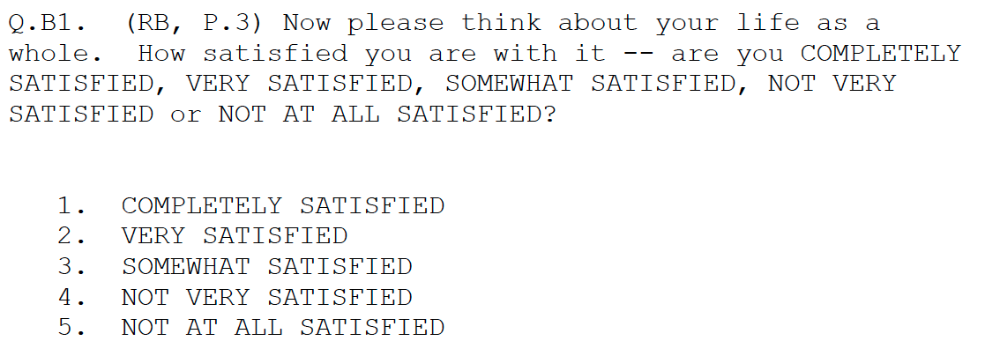
```

As shown in the histogram below, a majority respondents identified that they are "Very Satisfied" with their lives.


```{r,echo=FALSE}
# Note that data must be downloaded and processed (instructions in data_processing.R)
# prior to running this step

# reading in processed data
data <- fread('processed_data.csv')
ggplot(data,aes(x=`B1:SATISFACTION W/LIFE`,fill=factor(`B1:SATISFACTION W/LIFE`)))+
         geom_bar()+
         theme_bw()+
         labs(fill="'SATISFACTION W/ LIFE (1=high)'",y="Participant Count",title = "Histogram of Self-Reported Participant Satisfaction with Life")+
         theme(panel.grid.major.x = element_blank(),panel.grid.major.y = element_blank())
```

### Data Cleaning and Preprocessing

Our data processing pipeline contains 3 main steps:

```{r, echo=FALSE, out.width="90%"}
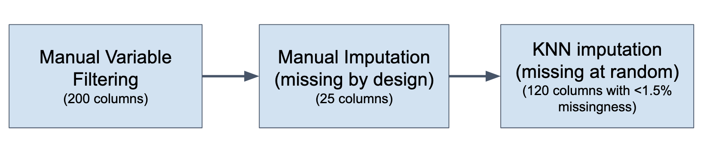
```

1. 1029 available Wave I variables were manually filtered down to 200 initial variables of interest. Variables were selected to reduce data redundancy and eliminate variables which would be difficult for use in an ordinal regression model (e.g. categorical variables with >10 potential categories) .

2. Manual imputation was performed on data which was deemed "missing by design". Missing by design data is commonly found in survey studies, and refers to survey questions which are purposefully left blank as a results of a participant's answers to previous questions. For example, if a participant responds that they are not currently married, further questions about characteristics of the marriage would be skipped.


```{r, echo=FALSE, out.width="90%"}
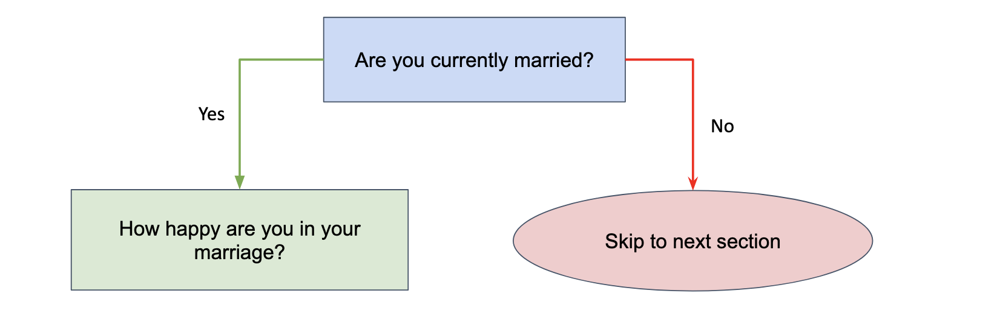
```

Our Ordinal Regression model cannot handle missing data, so it was necessary to impute missing by design data while preserving data integrity and allowing for meaningful interpretation. The imputation logic used was custom and varied across variables. For example, a variable measuring standardized (mean = 0) happiness in marriage was filled in with 0 for unmarried participants. Thus, any effect of this variable on our outcome can be interpreted as the effect of a deviation from the average happiness caused by a marriage.

3. After manual imputation, 120 columns remained with some level of missingness. The missingness in these columns was relatively low (<1.5%), and was assumed to be Missing at Random. K-nearest neighbors imputation was used to fill in missing values in the variables.

Future iterations of this analysis could include sensitivity analysis on the imputation methods used. The MAR assumption and treatment of missing by design data may have large effects on variable selection and analysis results. 


### Analysis Workflow

```{r, echo=FALSE, out.width="90%"}
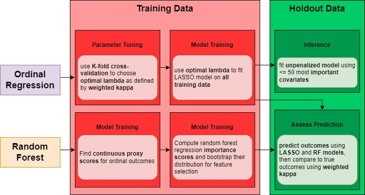
```

There were three main goals for our analysis

1. Use LASSO penalized ordinal regression and ordinal random forest models to reduce data set dimensionality.

2. Compare results (selected features and model performance) between the LASSO penalized ordinal regression and ordinal random forest models

3. Conduct inference on selected features using an unpenalized ordinal regression model to identify the magnitude and direction of covariate effects on life satisfaction.

Inference cannot be conducted on the data set used for variable selection. Similarly, model evaluation should be performed on an independent data set from the one used for model training. Thus, we split our data into a training data set (60% of observations) and a Holdout data set (40% of observations). 

Hyperparameter tuning and variable selection was conducted on the training data set. Tuned models were then trained on the training data set and evaluated on the holdout data set for model comparison. A final ordinal regression model (using selected variables and without penalization) was fit to the holdout data set for inference. 

### Ordinal Regression LASSO

*Note: See "ordreg_lasso_real_data.Rmd" for the code used to conduct the analysis described in this section.*

To find the best lambda as our tuning parameter, we perform a 5-fold cross validation within our training data using weighted kappa as our evaluation metric. Although we want to maximize our kappa value to have the most accurate model, our goal is to reduce the dimensionality of the dataset for model fitting inference. Thus, we heuristically select our lambda to fit both of these aims. The graphs below plot the number of non-zero parameters versus our testing kappa value within the cross validation. 

```{r, echo=FALSE, out.width="100%"}
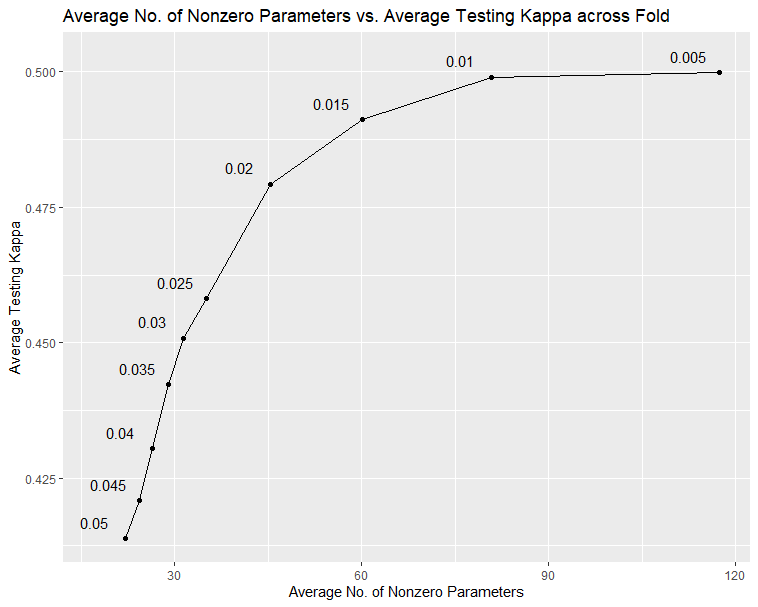
```

```{r, echo=FALSE, out.width="100%"}
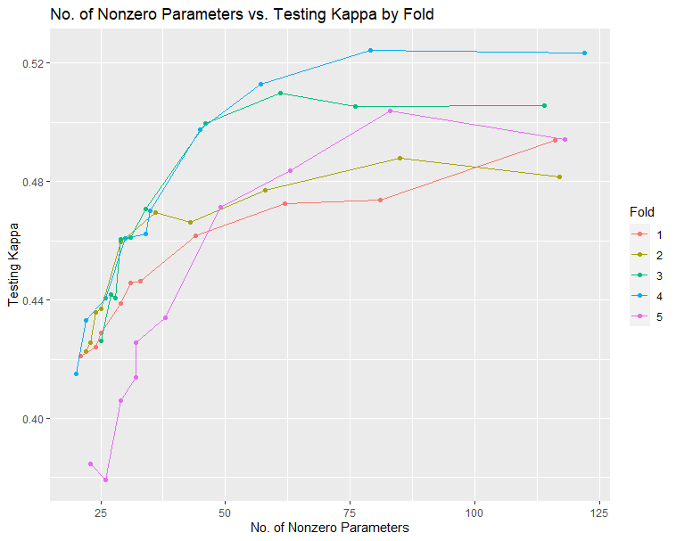
```

We select $\lambda=0.02$ to be our final $\lambda$ value to balance reducing dimensionality by keeping the number of nonzero parameters below 50. Although $\lambda=0.005$ had the best average testing kappa value, the difference of the average testing kappa value between $\lambda=0.02$ and $\lambda=0.005$ was about 0.02. 

We then fit an ordinal regression LASSO with $\lambda=0.02$ on all of the training data. This resulted in 39 nonzero betas with a testing kappa of 0.497 when predicting on the held-out dataset. 
Finally, we fit an ordinal regression with no penalty on the held-out dataset filtered to the 39 nonzero covariates. We then conduct inference on the beta values using a t-test with 1390 degrees of freedom. This resulting in 12 being significant. Some of most significant covariates are

1. Satisfaction with financial situation: being more satisfied with financial situation corresponded to being more satisfied with life.

2. Satisfaction with home: being more satisfied with one’s home corresponded to being more satisfied with life.

3. Could not get it “going”: The less someone could not get it “going” corresponded to being more satisfied with life.

4. Spouse in household: Not having a spouse in the household led to being more satisfied in life.

5. Marital harmony, Mean: an average of other responses that implied being more harmonious with one’s marriage corresponded to being more satisfied with life.


### Random Forest

*Note: See "Random_Forest_real_data.Rmd" for the code used to conduct the analysis described in this section.*

Ordinal Random Forest feature selection was performed using the HOOVS package on our training dataset. 36 features were selected by the model. 

A final ordinal random forest model was trained on the training data set using the 36 selected features, and evaluated on the holdout data set. 

As shown in the following confusion matrix, there is high agreement between the predicted and actual ordinal response. Incorrect predictions tend to cluster around the truth (e.g. true values of 1 are most often predicted to be 1 or 2).

```{r, echo=FALSE, out.width="100%"}
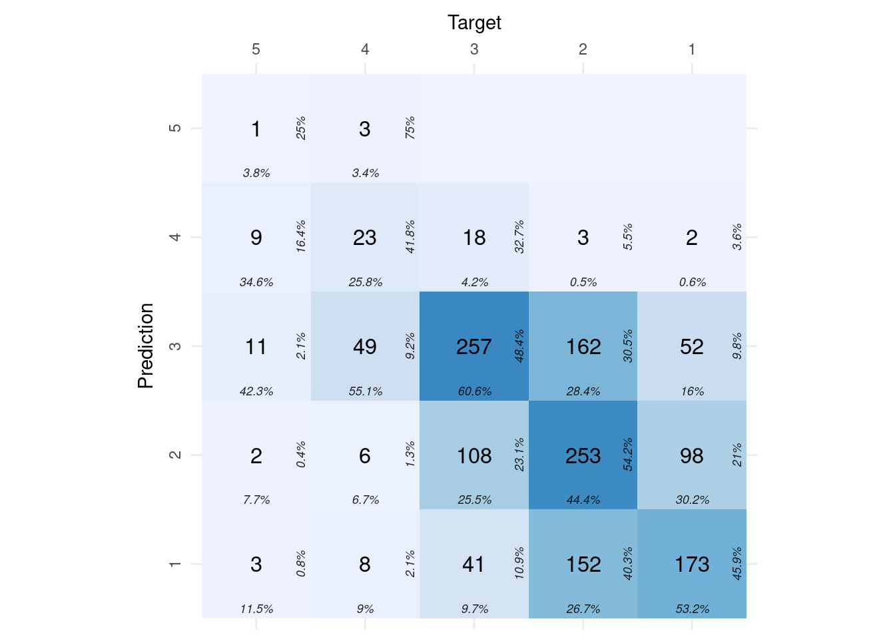
```

Feature plots (heatmaps, barcharts, and boxplots) were created to heuristically investigate the relationship between selected features and life satisfaction. 

#### Example feature plots

Higher satisfaction with home (1=high) is associated with higher satisfaction with life.

```{r, echo=FALSE, out.width="90%"}
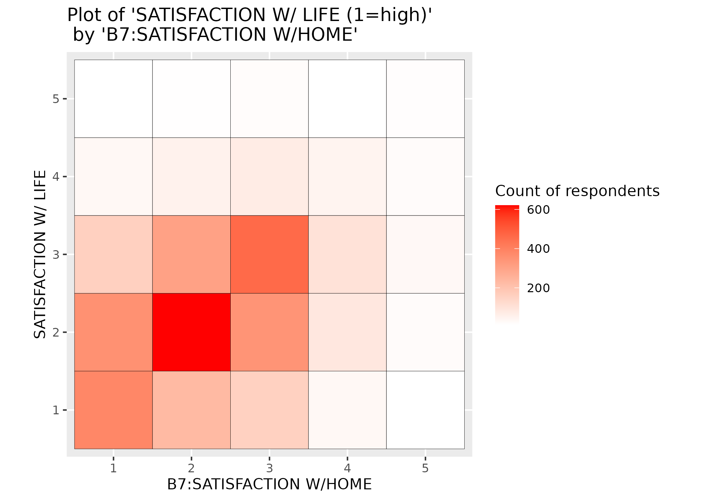
```

Higher levels of depression symptoms (CESD) is associated with lower satisfaction with life.

```{r, echo=FALSE, out.width="90%"}
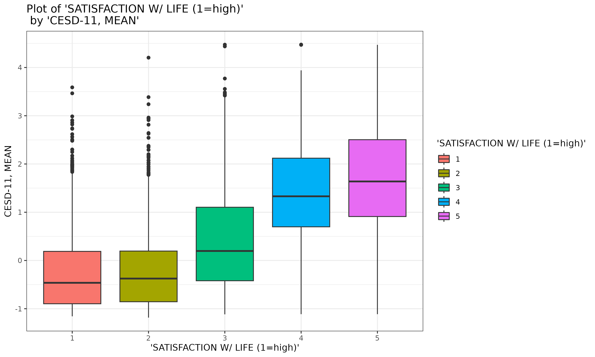
```

Lower financial stress is associated with higher satisfaction with life.

```{r, echo=FALSE, out.width="90%"}
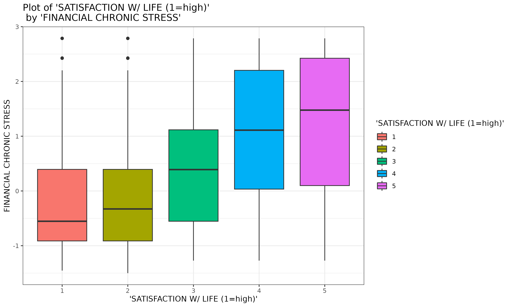
```

Feeling misunderstood is associated with lower satisfaction with life.

```{r, echo=FALSE, out.width="90%"}
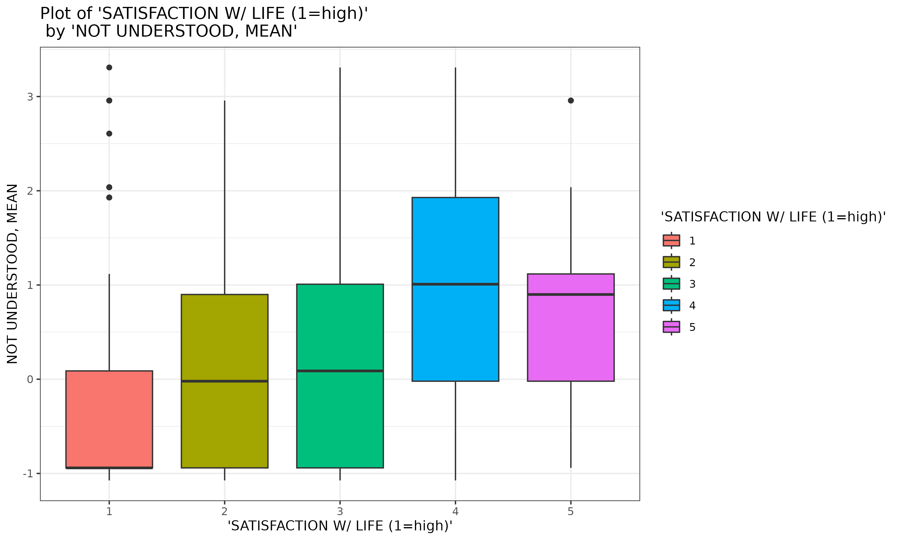
```

### Model Comparison

```{r, echo=FALSE, out.width="100%"}
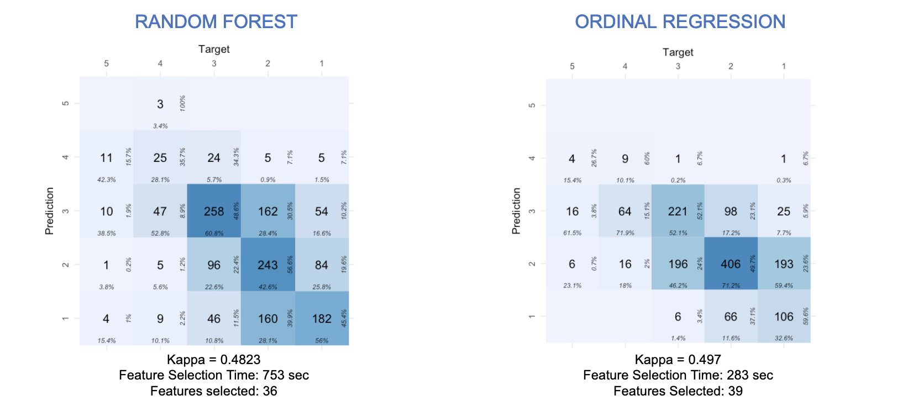
```
Both models had similar performance on the hold out dataset (evaluated using Weighted Kappa as a measure of agreement between predicted and actual ordinal response), and selected a similar number of features. Feature selection with the LASSO Ordinal Regression model took significantly less time, likely due to the bootstrapping and permutations used for the random forest feature selection algorithm.

20 features were selected by both models, indicating high levels of agreement between the feature selection algorithms. 

# Discussion

## Results

Both models indicate strong relationships (at least a self-reported relationship) between factors such as home satisfaction, levels of depression, financial stress, and feelings of being misunderstood (among others) with life satisfaction at the population level. While these conclusions may seem straightforward, it is important as statisticians to formalize factors which have a strong empirical association with life satisfaction.

Furthermore, another interesting result is the fact that the kappa values for both the ordinal regression and random forest were similar. However, because the ordinal regression takes much less time to fit and had straightforward interpretations for each covariate, the ordinal regression is preferable in this instance. 

## Limitations and Future Steps

There are some limitations to this analysis. First off, our model used proportional odds to assign ordinal outcomes. However, proportional odds are just one of many likelihood methods that could have bee used to model associations between ordinal outcomes. While easy to interpret, proportional odds can be a strong assumption warranting the use of other likelihood methods. Other potential methods include partial proportional odds, generalized ordered logit, Bayesian ordinal regression, and continuation ratio models. These choices of likelihood methods – while potentially more complicated – may be preferable if they more closely align with underlying data generating process.

Another limitation in this analysis was the need for extensive data preprocessing of the covariates. Many variables in the survey were coded such that some variables were more detailed answers that applied to only a subset of the population. As a result, we could not perform variables selection on the entire dataset -- rather a large subset of the data for which data preprocessing was manually feasible. 

One of the more meaningful limitations to the interpretation of our findings was the self-reported nature of survey data. Because nearly every variable in this dataset is self-reported, answers may not be reliable as those reported through more empirical means. Additionally, the Likert scales used in the survey may have subjective differences in interpretation across individuals. We chose to interpret covariates as continuous for the sake of creating a parsimonious model. However, coding the covariates as categorical variables and including interactions may reveal more complex trends in the data. Conversely, we interpreted the outcome to be an ordered categorical variable. However, interpreting the ourcome as a linear response – while a stronger assumption – provides more flexibility in terms of methods and modeling techniques.

The contents of this survey are very novel and interesting. However, future data collection pursuits which espouse more empirical data collection processes will help tease out any potential measurement error in self-reported outcomes and serve as a nice complement to this analysis. We believe that this work will have the strongest impact when used in cross-disciplinary studies pairing these results with studies in developmental psychology or public policy. 


